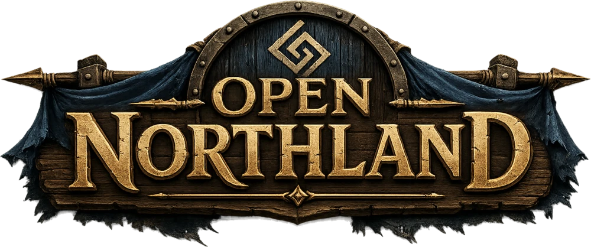

<h1 align="center">
  
</h1>

[](https://github.com/s-nems/open-northland/actions/workflows/ci.yml)
[](LICENSE)

Open Northland is an independent, cross-platform engine reimplementation for the Viking-era
*Cultures* strategy games. The engine is written in TypeScript and combines a deterministic
simulation, a PixiJS renderer, and an offline asset pipeline.

The repository contains no game installation files or decoded asset set. To use the original maps,
graphics, and audio, provide your own copy of *Cultures – 8th Wonder of the World* and generate the
local content directory with the included pipeline.


## Project status

Open Northland is pre-alpha. It is useful for development and testing, but it is not yet a complete
replacement for the original games.

The current build includes:

- a deterministic, fixed-timestep simulation with replay and state-hash tests;
- a working one-tribe settlement economy;
- building, gathering, production, progression, combat, fog, and population systems;
- an isometric renderer for decoded maps, terrain, buildings, settlers, effects, and HUD art;
- an offline pipeline for the original `.ini`, `.cif`, `.bmd`, `.pcx`, `.lib`, `.fnt`, and map files;
- headless acceptance scenarios and browser-based visual inspection scenes.

Campaigns, save games, computer opponents, multiplayer, and a packaged desktop release are still in
development. Open work is tracked in [`docs/tickets/`](docs/tickets/).

## Requirements

- Node.js 20.19 or later; Node.js 22.12 or later is recommended.
- A legally obtained copy of *Cultures – 8th Wonder of the World* for decoded game content.

The game is currently available from
[Steam](https://store.steampowered.com/app/351870/Cultures__8th_Wonder_of_the_World/) and
[GOG](https://www.gog.com/en/game/cultures_34).

## Build and test

```bash
npm install
npm run build
npm test
npm run check
```

The source, tests, and synthetic development scenes work without the original game. `npm run build`
typechecks every workspace and produces the browser bundle under `packages/app/dist/`.

## Generate local game content

Run the asset pipeline against your own game installation:

```bash
npm run pipeline -- --game "../Cultures 8th Wonder" --out content
npm run dev
```

`--game` accepts an absolute or relative path. The free
[CulturesNation](https://culturesnation.pl/) mod is required: installed inside the game folder
(`DataCnmd/`) it is detected automatically, and a copy unpacked elsewhere is passed with
`--mod-root <dir>`. The generated `content/` directory is ignored by Git and must not be
committed.

The development server opens on the main menu. Useful inspection entries include:

- `?scene=sandbox` for the main deterministic acceptance scene;
- `?anim` for the character animation gallery;
- `?sounds` for the sound-binding gallery;
- `?map=<id>` for a decoded map.

The full development-entry reference is in
[`packages/app/AGENTS.md`](packages/app/AGENTS.md#url-flag-entries).

## Repository layout

```text
packages/
  app/      Browser shell, input, menus, HUD, and acceptance scenes
  audio/    Web Audio playback and sound-selection policy
  data/     Validated schemas and content loaders
  render/   PixiJS isometric renderer
  sim/      Deterministic simulation core
tools/
  asset-pipeline/  Original game files to local validated content
content/            Generated locally; ignored by Git
docs/               Architecture, formats, testing, and open tickets
```

The simulation package has no browser or rendering dependencies and runs entirely headless. See
[`docs/ARCHITECTURE.md`](docs/ARCHITECTURE.md) and [`docs/ECS.md`](docs/ECS.md) for the design.

## Documentation

- [`docs/README.md`](docs/README.md) — documentation index
- [`docs/ARCHITECTURE.md`](docs/ARCHITECTURE.md) — package boundaries and data flow
- [`docs/ECS.md`](docs/ECS.md) — simulation and entity-component model
- [`docs/DATA-FORMAT.md`](docs/DATA-FORMAT.md) — generated content format
- [`docs/TESTING.md`](docs/TESTING.md) — test strategy and determinism checks
- [`docs/SCENES.md`](docs/SCENES.md) — acceptance-scene workflow
- [`docs/SOURCES.md`](docs/SOURCES.md) — source policy and format research
- [`docs/LEGAL.md`](docs/LEGAL.md) — licensing, game-data, and trademark notice

## Contributing

Contributions are welcome. Start with [`CONTRIBUTING.md`](CONTRIBUTING.md) and run
`npm run check`, `npm run build`, and `npm test` before opening a pull request.

Automated coding tools should also read [`AGENTS.md`](AGENTS.md). It contains the project-wide
determinism, data, performance, source-basis, and verification rules.

## License and trademarks

Open Northland is licensed under the GNU General Public License, version 3 or later. See
[`LICENSE`](LICENSE).

This is an independent community project. It is not affiliated with, authorized by, or endorsed by
Funatics Software, Daedalic Entertainment, or another rights holder of the *Cultures* series. Game
names are used only to describe compatibility. See [`docs/LEGAL.md`](docs/LEGAL.md) for the complete
project notice.
