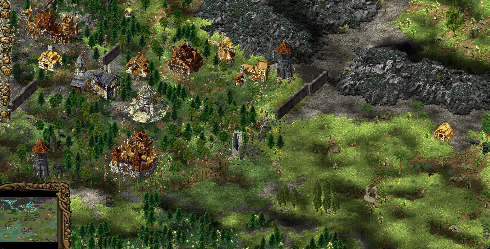

# Open Northland

[](https://github.com/s-nems/open-northland/actions/workflows/ci.yml)
[](LICENSE)

**Open Northland** is an open-source, cross-platform reimplementation of the Viking-era **Cultures**
settler/colony strategy series: *Cultures 2*, *Northland* (*Die Sage der Wikinger*), and
*8th Wonder of the World*. It is a fresh engine that pairs a deterministic simulation, an isometric
renderer, and an offline pipeline converting your own copy of the original game's data into a modern,
readable format. It is not a binary-faithful clone: where the original is buggy or unbalanced,
OpenNorthland is free to fix it.



> **You need to own the original game.** OpenNorthland ships **no game assets**. To actually play you
> need **Cultures – 8th Wonder of the World**, the latest and most complete game in the series and the
> one the asset pipeline targets. Point the pipeline at your own legally-owned copy, still sold on
> [Steam](https://store.steampowered.com/app/351870/Cultures__8th_Wonder_of_the_World/) and
> [GOG](https://www.gog.com/en/game/cultures_34). This is the same bring-your-own-data model used by
> [OpenMW](https://openmw.org/), [OpenRA](https://www.openra.net/) and
> [devilutionX](https://github.com/diasurgical/devilutionX).

## What it is (and isn't)

- **Is:** a fresh, deterministic colony simulation in TypeScript; an isometric PixiJS renderer; and
  an offline pipeline that decodes the original's `.cif` / `.bmd` / `.pcx` / `.lib` / `.ini` files
  into a versioned, diffable intermediate format (JSON + texture atlases).
- **Is not:** a binary-faithful re-implementation. 

## Status

Still a lot of work on the roadmap. 
Currently working on a single-tribe economy. The deterministic sim core, the asset pipeline (including
`.cif` decode), and a self-sustaining one-tribe settlement all run headless and deterministic:
settlers executing atomic actions, a goods economy, a progression/tech graph, and population growth. 
Active work is temporarily tracked in [`docs/tickets/`](docs/tickets/) - to be moved to GitHub issues.

## Getting started

**Requirements:** [Node.js](https://nodejs.org/) ≥ 20.19 (22.12+ recommended). To generate content
or play, you also need your own legally-owned copy of *Cultures – 8th Wonder of the World*.

```bash
npm install                 # one-time, installs all workspaces
npm run build               # typecheck/build all packages
npm test                    # headless sim tests (determinism golden tests)
npm run check               # Biome lint + format check (what CI runs)
```

You can build, test and develop the engine **without** the game — the sim runs headless against a
synthetic fixture. To turn real game data into playable content, point the pipeline at your copy:

```bash
# Decode YOUR owned game data into the intermediate format under content/ (gitignored):
npm run pipeline -- --game "../Cultures 8th Wonder" --mod DataCnmd --out content

npm run dev                 # launch the app (Vite) in a browser
```

The app opens on the main menu. `?scene=sandbox` starts the current acceptance scene directly, and
**`?anim`** opens the character **animation gallery** — every roster body, head, player
colour and facing (needs decoded `content/`). The full URL-flag reference lives in
[`packages/app/AGENTS.md`](packages/app/AGENTS.md).

`--game` is the path to your game-install folder; the example assumes you placed it **next to this
repo** (`../Cultures 8th Wonder`), but any absolute or relative path works. `--mod DataCnmd` selects
the data of the [culturesnation](https://culturesnation.pl/) fan mod, a free community mod installed
into the game folder (it does **not** ship with the retail game). The mod is preferred because its
rules are plain `.ini` rather than encrypted `.cif` (see
[`docs/DATA-FORMAT.md`](docs/DATA-FORMAT.md)). `--mod` is optional, but the mod is the well-tested path.

Desktop builds (macOS / Windows / Linux) come later via Tauri; the app is browser-first so it is
cross-platform from day one.

## Repository layout

```
open-northland/
├── packages/
│   ├── sim/      # deterministic simulation core (ECS). No rendering, no DOM. The heart.
│   ├── data/     # intermediate-format schemas (zod) + loaders. Shared content model.
│   ├── render/   # PixiJS isometric renderer. Reads sim snapshots, draws.
│   ├── audio/    # Web Audio layer: positional SFX, terrain ambient, jingles, voice chatter.
│   └── app/      # game shell: wires sim+render+input, menus, main loop (Vite).
├── tools/
│   └── asset-pipeline/  # offline CLI: original .cif/.bmd/.pcx/.lib/.ini -> content/ (PNG+JSON)
├── content/     # GENERATED intermediate assets (gitignored — derived from YOUR game copy)
└── docs/        # architecture, ECS, data format, tickets, sources
```

Why the split: the **sim** package has zero rendering dependencies, so it runs headless under
`vitest`. That makes mechanics verifiable without a screen, and keeps the simulation deterministic
and lockstep-friendly. See [`docs/ARCHITECTURE.md`](docs/ARCHITECTURE.md) and
[`docs/ECS.md`](docs/ECS.md).

## Documentation

[`docs/README.md`](docs/README.md) indexes everything and gives the reading order. The essentials:

- [`docs/ARCHITECTURE.md`](docs/ARCHITECTURE.md) — the big picture and package boundaries
- [`docs/ECS.md`](docs/ECS.md) — the entity-component-system and atomic-action planner
- [`docs/DATA-FORMAT.md`](docs/DATA-FORMAT.md) — the intermediate content format (IR)
- [`docs/TESTING.md`](docs/TESTING.md) — the determinism / self-validation test pyramid
- [`docs/SCENES.md`](docs/SCENES.md) — acceptance scenes (watch a mechanic, sign off)
- [`docs/SOURCES.md`](docs/SOURCES.md) — original file formats and the (canonical) legal posture
- [`docs/PRIOR-ART.md`](docs/PRIOR-ART.md) — practices from other engine reimplementations: adopted / deferred / consciously different
- [`docs/tickets/`](docs/tickets/) — the live work tracker (one self-contained task per file)

## Contributing

Contributions are welcome — see [`CONTRIBUTING.md`](CONTRIBUTING.md). Keep new code in the style of
the file around it, keep the `sim` package deterministic and pure, and run `npm run check && npm test`
before opening a PR. Agents working in this repo should read [`AGENTS.md`](AGENTS.md) first — it is
the contract for conventions, the determinism rules, and the legal guardrails.

## Acknowledgements

- Credits to [`OpenVikings_reversing`](https://github.com/Ravo92/OpenVikings_reversing) by **Ravo92** - an
  independent, binary-faithful reverse-engineering of the original engine. OpenNorthland is a
  separate project that consults it as file-format documentation and as an oracle for validating
  decoded assets. None of its source is ported. Thank you for the format work.
- [culturesnation](https://culturesnation.pl/) community for still keeping the game alive and all excellent work on the mod.

## Legal

> The authoritative statement of the project's legal posture is
> [`docs/SOURCES.md`](docs/SOURCES.md) (**Legal line**); this section restates it for readers.

**License.** OpenNorthland is free software, released under the **GNU General Public License v3.0 (or
later)** (`GPL-3.0-or-later`). See [`LICENSE`](LICENSE). OpenNorthland is distributed in the hope that it will be useful, but
**without any warranty**; see the license for details.

**No game content.** This repository contains **no original game assets** and no copyrighted content
from the *Cultures* series. It ships engine source code only. The generated `content/` directory
(decoded sprites, rules, maps) is produced locally from **your own legally-owned copy** of the game
and is never committed.

**Trademarks.** *Cultures – 8th Wonder of the World*, *Cultures*, and related names and logos are
trademarks or registered trademarks of their respective owners (Funatics Software GmbH and/or its
licensors). They are used here only descriptively, to state what OpenNorthland is compatible with.

**Disclaimer.** OpenNorthland is an independent, fan-made project. It is **not affiliated with, authorized
by, endorsed by, or in any way associated with** Funatics Software GmbH or any other rights holder
of the *Cultures* series. All trademarks and copyrights remain the property of their respective
owners.
