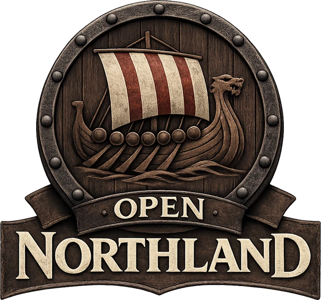
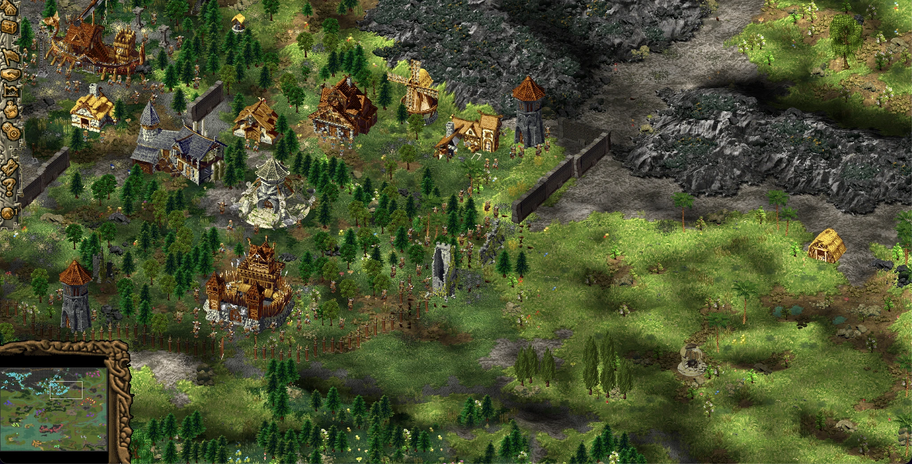

<h1 align="center">
  
</h1>

[](https://github.com/s-nems/open-northland/actions/workflows/ci.yml)
[](LICENSE)

Open Northland is an independent, cross-platform engine for *Cultures - 8th Wonder of the World*, a
Viking-era strategy game. It combines a deterministic TypeScript simulation, a PixiJS renderer, and
an offline asset pipeline.

The repository never contains original game files or decoded content. 
The maps, graphics, and audio come from the original game.

You can play-test it from: [game.opennorthland.org](https://game.opennorthland.org)



## Status

Open Northland is pre-alpha. The current build has a playable settlement economy, building,
gathering, production, progression, combat, fog, population systems, and a basic computer player.
It can load decoded maps and render terrain, buildings, settlers, effects, and the HUD.

## Requirements

- Node.js `^20.19.0` or `>=22.12.0`
- For playable content, the pinned CulturesNation archive (`CnMod 1.3.2.zip`, about 570 MB), which
  `npm run build:content` downloads and converts.

## Starting the project

#### Installing dependencies 
```bash
npm ci
npm run build
```

#### Generating local content and starting dev server 
```bash
npm run build:content
npm run dev
```

#### Running local tests
```bash
npm test
npm run check
```

`build:content` verifies the archive's SHA-256, unpacks it, replaces `content/`, and runs the
pipeline, exactly as the release does; `-- --zip <file>` converts a local copy of the archive instead
of downloading it. While working on the pipeline itself, run `npm run pipeline` directly against an
unpacked mod (see `docs/DEVELOPMENT.md`).

Converted content is ignored by Git. Never commit it, and never share it or a build that carries it
outside the channel `docs/LEGAL.md` allows.

## Repository layout

```text
packages/
  app/               Browser shell, input, menus, HUD, and scenes
  art-contracts/     Shape contracts the project's own assets are validated against
  audio/             Sound selection and Web Audio playback
  data/              Validated schemas and content loaders
  desktop/           Electron shell serving the app and the converted content
  lockstep/          Session driver: when a tick runs and which commands it carries
  net-client/        One client of a relayed session
  net-protocol/      Lockstep wire protocol
  net-server/        Multiplayer relay
  render/            PixiJS isometric renderer
  sim/               Deterministic simulation
tools/
  asset-pipeline/    Converts the CulturesNation mod into the served content tree
  art-pipeline/      Builds and publishes the project's own assets
deploy/web/          nginx image of the built app and the converted content
scripts/             Repository checks, content build, benchmarks
content/             Converted locally or by the release, ignored by Git
docs/                Design notes, format research, and open tickets
```

Start with the [documentation index](docs/README.md) for the design and data flow.

## Working in the repository

Read [`CONTRIBUTING.md`](CONTRIBUTING.md) before opening a pull request. Coding agents must also
read [`AGENTS.md`](AGENTS.md).

## License and trademarks

Open Northland's code is licensed under AGPL-3.0-or-later. See [`LICENSE`](LICENSE). The project's
own artwork, sounds, and models are not: their terms are in [`LICENSE-ASSETS`](LICENSE-ASSETS).

This is an independent project. It is not affiliated with or endorsed by Funatics Software, Daedalic
Entertainment, or another rights holder of the *Cultures* series. Game names are used only to
describe compatibility. The full notice is in [`docs/LEGAL.md`](docs/LEGAL.md).
